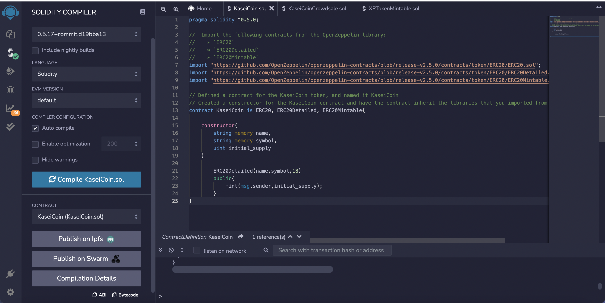
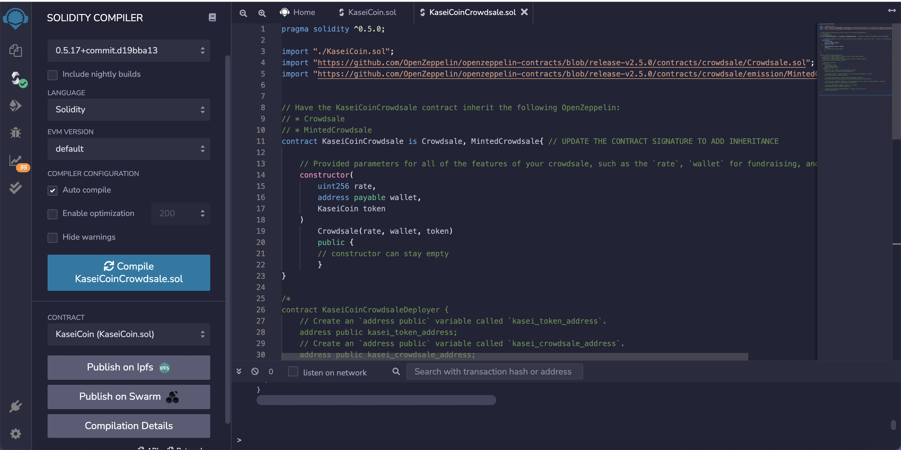
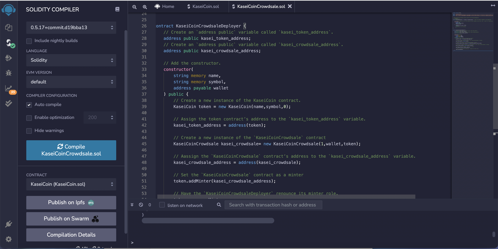
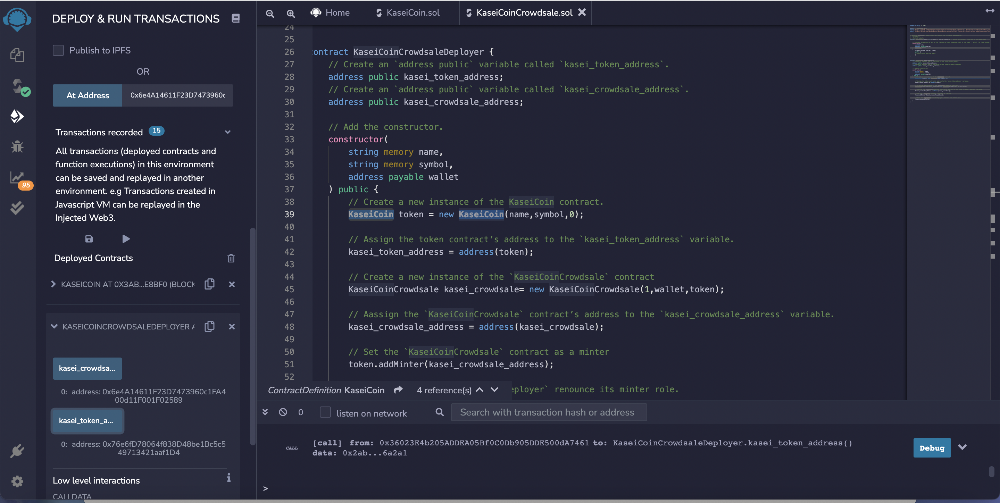

# Advance-Solidity

#### Background

This assignment requires developing a monetary system using blockchain technology and to define a new cryptocurrency named KaseiCoin. KaseiCoin will be a fungible token that’s ERC-20 compliant. Also launch a crowdsale that will allow people wto convert their money to KaseiCoin.

The steps for this assignment are divided into the following subsections:

- Create the KaseiCoin Token Contract
- Create the KaseiCoin Crowdsale Contract
- Create the KaseiCoin Deployer Contract
- Deploy and Test the Crowdsale on a Local Blockchain

##### Step 1: Create the KaseiCoin Token Contract

Created a smart contract that defines KaseiCoin as an ERC-20 token. 

##### Step 2: Create the KaseiCoin Crowdsale Contract

In this subsection, defined the KaseiCoin crowdsale contract. To do so, complete the following steps:

1. This contract inherit the following OpenZeppelin contracts:
    - Crowdsale
    - MintedCrowdsale
  
2. In the KaisenCoinCrowdsale constructor, provided parameters for all the features of your crowdsale, such as rate, wallet (where to deposit the funds that the token raises), and token. Configured these parameters as KaseiCoin token.

3. Compiled the contract by using compiler version 0.5.0.

##### Step 3: Create the KaseiCoin Deployer Contract
In this subsection, Created the KaseiCoin deployer contract. 

In the KaseiCoinCrowdsaleDeployer contract, added variables to store the addresses of the KaseiCoin and KaseiCoinCrowdsale contracts, which this contract will deploy. To complete the KaseiCoinCrowdsaleDeployer contract. To do so, complete the following steps:

1. Created an address public variable named kasei_token_address, which will store the KaseiCoin address once that contract has been deployed.
2. Created an address public variable named kasei_crowdsale_address, which will store the KaseiCoinCrowdsale address once that contract has been deployed.
3. Added the following parameters to the constructor for the KaseiCoinCrowdsaleDeployer contract: 
    - name 
    - symbol and 
    - wallet
4. Inside of the constructor body, completed the following steps:
    - Create a new instance of the KaseiCoinToken contract.
    - Assign the address of the KaseiCoin token contract to the kasei_token_address variable. (This will allow you to easily fetch the token's address later.)
    - Create a new instance of the KaseiCoinCrowdsale contract by using the following parameters:
      - The rate parameter: Set rate equal to 1 to maintain parity with ether.
      - The wallet parameter: Pass in wallet from the main constructor. This is the wallet that will get paid all the ether that the crowdsale contract raises.
      - The token parameter: Made this the token variable where KaseiCoin is stored.
    - Assigned the address of the KaseiCoin crowdsale contract to the kasei_crowdsale_address variable. (Later this will allow to fetch the crowdsale’s address easily.)
    - Set the KaseiCoinCrowdsale contract as a minter.
    - Had the KaseiCoinCrowdsaleDeployer renounce its minter role.
5. Compiled the contract by using compiler version 0.5.0.

##### Step 4: Deploy and Test the Crowdsale on a Local Blockchain
In this subsection, deployed the crowdsale to a local blockchain. Performed a real-world, preproduction test of crowdsale. To do so, completed the following steps:

- Deployed the crowdsale to a local blockchain by using Remix, MetaMask, and Ganache.
- Tested the functionality of the crowdsale by using test accounts to buy new tokens and then checking the balances of those accounts.
- Reviewed the total supply of minted tokens and the amount of wei that the crowdsale contract has raised.
###### Deployment Screenshot

###### Functionality & wei raised

